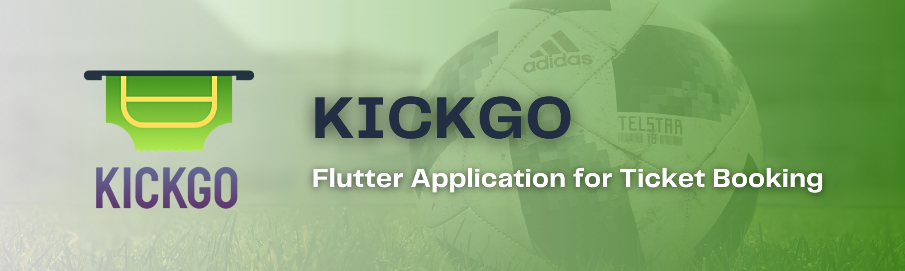
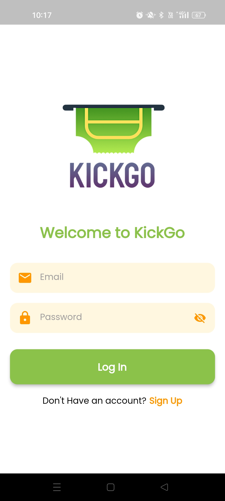
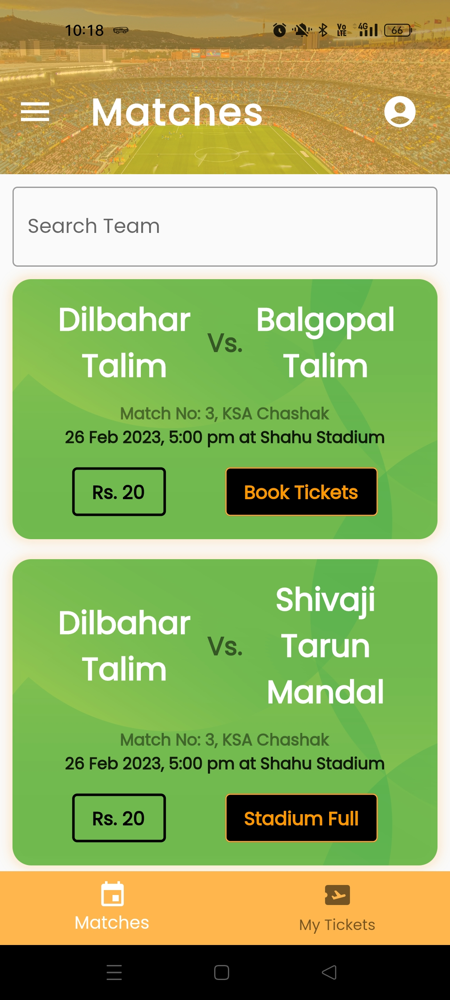

<a name="readme-top"></a>

[![Contributors][contributors-shield]][contributors-url]
[![Forks][forks-shield]][forks-url]
[![Stargazers][stars-shield]][stars-url]
[![Issues][issues-shield]][issues-url]
[![LinkedIn][linkedin-shield]][linkedin-url]

<!-- PROJECT LOGO -->
<br/>
<div align="center">
  <a href="https://github.com/siddhesh-desai/kickgo">
    
  </a>
    <br>
    <br>

  <h3 align="center"><b>KICKGO</b></h3>

  <p align="center">
    KICKGO is a dynamic Flutter application designed to revolutionize the ticket booking process for football matches. With a focus on convenience and user experience, the app allows football enthusiasts to easily purchase tickets, generate QR codes for entry, and enjoy additional benefits such as earning redeemable coins.
    <br />
    <br>
    <a href="https://github.com/siddhesh-desai/kickgo"><strong>Explore the docs »</strong></a>
    <br />
    <a href="https://github.com/siddhesh-desai/kickgo">View Demo</a>
    ·
    <a href="https://github.com/siddhesh-desai/kickgo/issues">Report Bug</a>
    ·
    <a href="https://github.com/siddhesh-desai/kickgo/issues">Request Feature</a>

  </p>
</div>

<!-- ABOUT THE PROJECT -->
<br>

## ♾️ About The Project

KICKGO is a dynamic Flutter application designed to revolutionize the ticket booking process for football matches. With a focus on convenience and user experience, the app allows football enthusiasts to easily purchase tickets, generate QR codes for entry, and enjoy additional benefits such as earning redeemable coins.

Using the KICKGO app, users can browse through a list of upcoming football matches, select their preferred match, and purchase tickets seamlessly within the application. Upon successful ticket purchase, a unique QR code is generated for each ticket. This QR code serves as a digital ticket, eliminating the need for physical passes and simplifying the entry process for users.

To ensure secure and efficient entry to the stadium, KICKGO leverages the QR code scanning functionality. At the stadium gates, the user's QR code is scanned by the staff, verifying the authenticity of the ticket. Once the QR code is scanned and validated, the user's status is updated in real-time as "entered the stadium." This system ensures smooth entry management and enhances security measures.

In addition to providing hassle-free entry, KICKGO incorporates a rewarding system for users. Each time a ticket is purchased and the QR code is scanned for entry, the user earns coins. These coins can be accumulated and later redeemed for various benefits such as exclusive merchandise, discounts on future ticket purchases, or even VIP experiences. This feature incentivizes users to engage with the app and attend more football matches, enhancing their overall fan experience.

KICKGO is built using the Flutter framework, enabling a cross-platform mobile application available for both Android and iOS devices. Flutter's versatility ensures a seamless and visually appealing user interface, providing a consistent experience across different devices. The app is designed to be intuitive and user-friendly, ensuring easy navigation and a delightful user experience.

The ultimate goal of KICKGO is to revolutionize the ticket booking process for football matches, making it more convenient and rewarding for fans. By utilizing QR codes, the app simplifies the entry process, enhances security, and eliminates the need for physical tickets. The inclusion of a rewarding system adds an exciting element for users, incentivizing attendance and fostering a sense of loyalty among football enthusiasts.

With KICKGO, football fans can indulge in their passion for the game while enjoying a seamless ticket booking experience and reaping the benefits of redeemable coins. The app's integration of technology and user-centric features contributes to enhancing the overall football match experience and promotes a stronger connection between fans and the game they love.

<p align="right">(<a href="#readme-top">back to top</a>)</p>

## ⚙️ Built With

The technologies and tools used are:

- [![Flutter][flutter]][flutter-url]
- [![Dart][dart]][dart-url]
- [![Firebase][firebase]][firebase-url]

<p align="right">(<a href="#readme-top">back to top</a>)</p>

<!-- GETTING STARTED -->

## 🧑‍💻 Getting Started

Follow the below steps to set up the project:

### Prerequisites

The project needs Flutter aand Android Studio installed in your system. Once installed, follow the below steps:

### Installation

1. Clone the repository

   ```sh
   git clone https://github.com/siddhesh-desai/kickgo.git
   ```

2. Connect your device using USB Cable or keep emulator installed. Run the below command.

   ```sh
   flutter run
   ```

## 💡 Features

<br>

- Login/Signup
- Match Details
- User Profile
- Entry QR Code
- Rewards

<p align="right">(<a href="#readme-top">back to top</a>)</p>

<!-- ROADMAP -->

## 🛣️ Roadmap

- [x] Login/Signup
- [x] Match Details
- [x] User Profile
- [x] Entry QR Code
- [ ] Rewards

See the [open issues](https://github.com/siddhesh-desai/kickgo/issues) for a full list of proposed features (and known issues).

<p align="right">(<a href="#readme-top">back to top</a>)</p>

<!-- CONTRIBUTING -->

## 👣 Contributing

Any contributions you make are **greatly appreciated**.

If you have a suggestion that would make this better, please fork the repo and create a pull request. You can also simply open an issue with the tag "enhancement".
Don't forget to give the project a star! Thanks again!

1. Fork the Project
2. Create your Feature Branch (`git checkout -b feature/AmazingFeature`)
3. Commit your Changes (`git commit -m 'Add some AmazingFeature'`)
4. Push to the Branch (`git push origin feature/AmazingFeature`)
5. Open a Pull Request

<p align="right">(<a href="#readme-top">back to top</a>)</p>

<!-- CONTACT -->

## 📧 Contact

Siddhesh Desai - [@thesiddheshdesai](https://www.linkedin.com/in/thesiddheshdesai/) - siddheshdesai777@gmail.com

Project Link: [https://github.com/siddhesh-desai/kickgo](https://github.com/siddhesh-desai/kickgo)

<p align="right">(<a href="#readme-top">back to top</a>)</p>

## 📸 Screenshots

<br>

<br>

<br>

## ✨ Contributors

Thanks go to these wonderful people:

- [Siddhesh Desai](https://github.com/siddhesh-desai/)
- [Devraj Babar](https://github.com/devrajbabar9/)

[contributors-shield]: https://img.shields.io/github/contributors/siddhesh-desai/kickgo.svg?style=for-the-badge
[contributors-url]: https://github.com/siddhesh-desai/kickgo/graphs/contributors
[forks-shield]: https://img.shields.io/github/forks/siddhesh-desai/kickgo.svg?style=for-the-badge
[forks-url]: https://github.com/siddhesh-desai/kickgo/network/members
[stars-shield]: https://img.shields.io/github/stars/siddhesh-desai/kickgo.svg?style=for-the-badge
[stars-url]: https://github.com/siddhesh-desai/kickgo/stargazers
[issues-shield]: https://img.shields.io/github/issues/siddhesh-desai/kickgo.svg?style=for-the-badge
[issues-url]: https://github.com/siddhesh-desai/kickgo/issues
[license-shield]: https://img.shields.io/github/license/siddhesh-desai/kickgo.svg?style=for-the-badge
[license-url]: https://github.com/siddhesh-desai/kickgo/blob/master/LICENSE.txt
[linkedin-shield]: https://img.shields.io/badge/-LinkedIn-black.svg?style=for-the-badge&logo=linkedin&colorB=555
[linkedin-url]: https://linkedin.com/in/thesiddheshdesai
[flutter]: https://img.shields.io/badge/Flutter-000000?style=for-the-badge&logo=flutter&logoColor=white
[flutter-url]: https://docs.flutter.dev/
[dart]: https://img.shields.io/badge/Dart-0769AD?style=for-the-badge&logo=dart&logoColor=white
[dart-url]: https://dart.dev/guides
[firebase]: https://img.shields.io/badge/Firebase-20232A?style=for-the-badge&logo=firebase&logoColor=61DAFB
[firebase-url]: https://firebase.google.com/docs/
